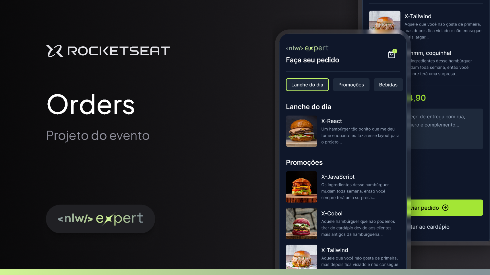

<p align="center">
  
</p>

# NLW Expert ✨

## 🖥️ Projeto

Projeto de uma aplicação mobile para simular a realização de pedidos de uma hamburgueria, desenvolvida durante o NLW Expert da Rocketseat.

## 🚀 Tecnologias

Esse projeto foi desenvolvido utilizando as seguintes tecnologias:

- Expo
- TypeScript
- React Native
- TailwindCSS

## 📱 Executando

1. Baixe a aplicação <b>Expo Go</b> em seu iOS ou Android, ou instale um emulador no PC
2. Clone o repositório
3. Após clonar o repositório, execute o comando na pasta do projeto:
```bash
npx expo start
```
4. Escaneie o QR Code do seu celular ou abra o emulador.
5. <b>Não esqueça:</b> No arquivo /src/app/card.tsx adicione um número de WhatsApp❗️


## 🔖 Layout
Você pode ver o layout do projeto
[aqui](https://www.figma.com/community/file/1336456468568916765/nlw-expert-orders).

